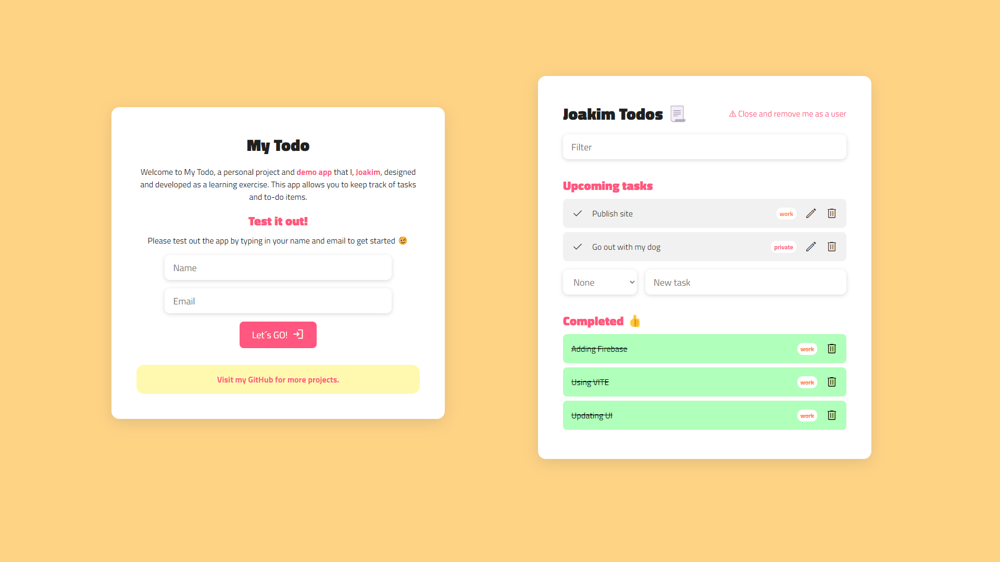

# My todo app 🗒️

Solution URL: https://www.jotto.dev/project/my-todo/

## Sprint 1 - WIP 2022-12 [DONE] 👏

✅ Adding Firebase as database

✅ Using VITE

✅ Simple user handling

✅ Updating UI for better exp.

**A learning project to get more knowledge about:**

* Databases, API, CRUD
* TypeScript
* filter()
* find() and more...
* Dataset
* How to filter content

